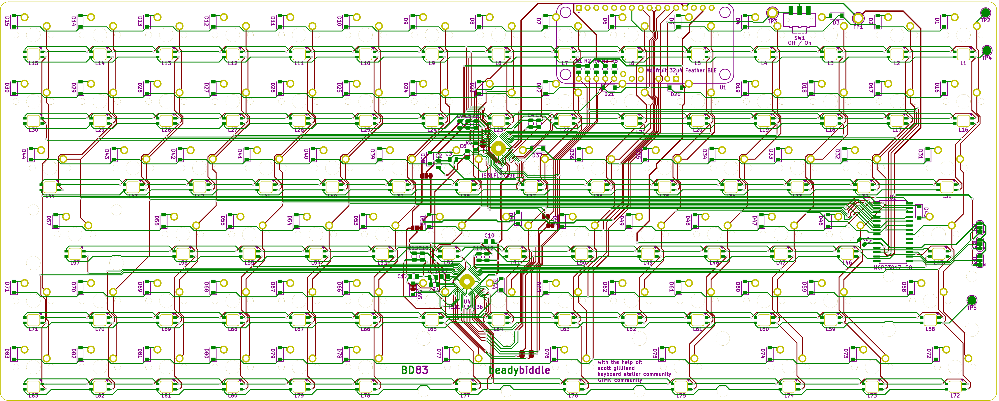

# BD83
A fully custom 83 Key mechanical keyboard designed around the way that I type. I intend to be able to say that this is truly a keyboard customized to my liking.
The original motivation behind this project was just a frustration at standard ANSI layouts. This project features custom everything, including PCB, plate, case, firmware, and eventually keycaps. Before creating anything, I initially just filmed my hands typing and gaming for an hour to figure out my own tendencies and key usage.

### Layout changes:
- Space bar is shrunk and split because nobody needs six keys' worth of real estate to hit one button.
- Backspace is shrunk because I don't intend to use it there. I've added a secondary backspace between the space bars.
- Caps lock is useless. I've removed it.
- Right shift is useless. I've removed it.
- Numpad function is incorporated into the FN layer on the lefthand side.
- Nav cluster has been moved around the arrow keys so it's easier and more intuitive to navigate code with home/end.
- F13 is now a thing because I had room for it.

### Hardware
There are three main custom hardware components to this keyboard:
- PCB, self explanatory
- Plate, the layer that the keyswitches clip into
- Case, the pieces that house the rest of the board
#### Plate
Keyboards don't necessarily need a plate, but for a myriad of reasons it made sense for me to use one. The plate is 0.06" 304 stainless steel, making it unyielding which is better for linear switch typefeel. I generated a template in swillKB then modeled the plate in Fusion360. Using the DXF exported from Fusion, I waterjet cut the plate.
TODO insert plate dxf and photo here

#### Case
I've designed two cases, one which is full-sized and intended to be printed on a Form 3L SLA printer at the GaTech Invention Studio, and another which is minimal (hardly qualifying as a case) that I printed on my Voxelab Aquila. All outward-facing edges are chamfered or filleted to look nice and not hurt the flesh. On the back is a hole for a USB-C adapter dongle to poke through. The underside features a pretty beadybiddle logo and some rubber feet made from EPDM rubber bands. I also designed a wrist rest to be extra, but I've made the case so slim that it's not necessary.
I was unable to get access to the Form 3L before the studio closed for the year.
  
The two halves of the case are fastened by eight M3x10 machine screws and nuts around the perimeter. The plate has flanges around the edges that allow it to be sandwiched between these two halves, cushioned by strips of EPDM to dampen the sound and make the typefeel just a little springy. The interior of the case has only 0.8mm of wiggle room to the dangling PCB, making it literally as compact as possible. It is angled five degrees so that the front height is minimized while making room for the Feather board and batteries in the back.
 

The minimal "case" is actually four feet that clip onto the plate and are secured by a single large band. It has the same five degree inclination as the full case so that the electronics won't touch the desk surface. The open design leaves the switches and PCB accessible.

TODO insert photo

#### PCB
The PCB took the longest of all the components (maybe because I'd never made one before) but I'll try to keep it brief here:
I made it to support three main features: bluetooth, RGB lighting, and some level of expandability.
The brains of the board is an Adafruit Feather 32u4 Bluefruit LE, which is a devboard with an intregated nRF51822 BLE module. It also handles LiPo power for going completely wireless.
The LEDs are common-anode RGB packages, and are controlled by two IS31FL3733B drivers. The MCU talks to these drivers via I2C. I was originally planning to use a string of WS2812Bs or SK6812Es, but these have a substantially higher power draw than the ISSI scanning matrix drivers.
There are only 20 GPIO pins on the Feather, though, and several are already used for SPI with the BLE module. In order to accomodate my ideal 83 keys, it would take at least 19 pins to connect all the switches even with matrix duplexing, a number that I couldn't muster while dedicating three to the LED drivers. To get get some extra GPIO, I use an MCP23017 I2C I/O expander. This communicates on the same I2C lines as the ISSI drivers, and creates an additional 16 GPIO pins - more than enough for the rest of the switch matrix.

Diodes are placed between each switch and its corresponding row to prevent ghosting as the matrix is scanned.
VCC is fed through decoupling caps as needed to the slave chips; decoupling around the MCU is already handled by the Feather board.
The address pins on the three I2C chips have solder bridges for customizing the addresses if more devices are added.
A SPDT switch controls the 3V3 regulator enable pin so that power can be controlled, especially when going wireless.

The PCB was definitely the most fun part of this whole project; learning to make something so different from what I'm used to was nice.
I routed all of the traces twice because after getting an understanding and making some messy paths the first time it was much easier to organize the rats nest from scratch.
I also went through several iterations of component placements in the process in order to make room for the traces and switches. Most keyboards have plenty of free real estate behind their big spacebars or above the arrow keys, but my compact layout meant everything had to be crammed in tight gaps.
 

This was also the first time I'd done reflow soldering, but that was easy enough with the stencil and oven. And only one diode was backwards!

Designed in KiCad and fabricated by JLCPCB.

### Firmware
Easily the most difficult (or maybe just frustrating?) part, I wrote custom firmware for the board with the help of the QMK framework. QMK handles a lot of the nitty gritty stuff so that I instead dedicate dozens of hours to custom matrix scanning and debugging the RGB.
Defining switch order, keymappings, and LED positions was tedious but simple. The real problem was that as far as I can tell, I'm the first person to make a keyboard that drives rows from the MCU and read columns from an IO expander.
I visited square one a few times, rewriting the firmware each time I ran into a deadend that couldn't be debugged.
The first time, I thought the board wasn't flashing. Turns out it was flashing, but the firmware I wrote sucked so bad that it kicked back into bootloader.
The second time, I had it flashed but nothing responded and no debug messages even printed. I never figured out why, because I just rewrote everything after a day of failed debugging.
Finally I have the (mostly) working firmware, which is fully functional as a keyboard input and also supports typing over bluetooth. Unfortunately the RGB still doesn't work for some unknown reason, but luckily the BLE meets the critera for additional features to the keyboard.

